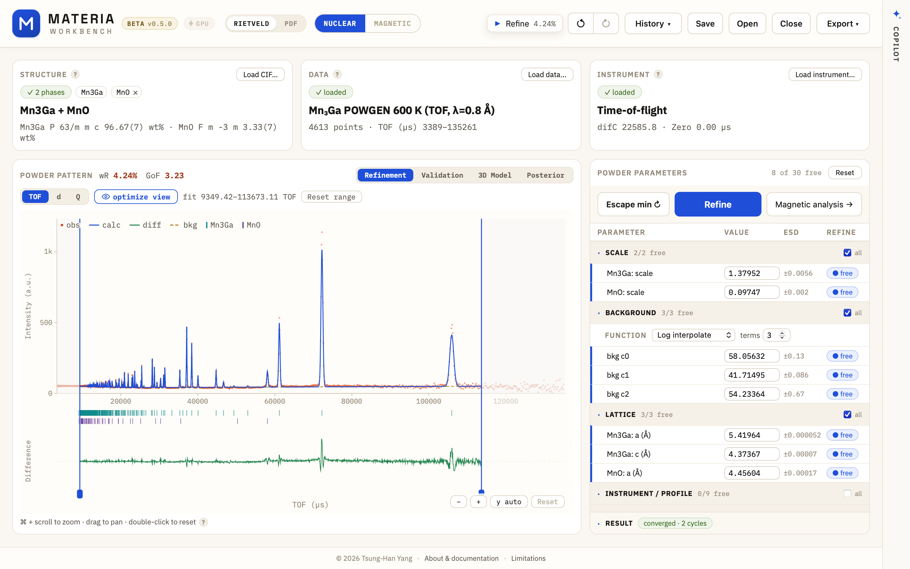

# MATERIA

[](https://drthyang.github.io/materia-platform/)
[](docs/LIMITATIONS.md)
[](LICENSE)

**Crystal and magnetic structure refinement in the browser, built to be driven by people and by AI agents.**

MATERIA refines crystal and magnetic structures against diffraction and total-scattering data in a web
page, with nothing to install and the data never leaving your machine. The **MATERIA Copilot** puts a
language model beside the analysis: it changes things only through the page's own controls, asking first.

**Live site: [drthyang.github.io/materia-platform](https://drthyang.github.io/materia-platform/)**

<p align="center">
  
</p>

## What it does

- **Powder Rietveld.** X-ray and neutron, constant wavelength and time of flight, several phases,
  microstructure. Reads GSAS-II, GSAS and FullProf instrument files and writes a FullProf / GSAS-II
  cross-check bundle.
- **Magnetic structures.** From the peaks the nuclear model leaves, to the propagation vector k, to the
  magnetic space groups k allows (BNS/OG) ranked against the data, to refined moments and an mCIF.
  Representation analysis at any commensurate k; commensurate and incommensurate single-k.
- **Single crystal.** F² refinement from hkl, SHELX and FullProf lists, with extinction, twins and
  absolute structure.
- **PDF and magnetic PDF.** Neutron and X-ray G(r), several phases and datasets, boxcar scans, and a
  PDFgui / diffpy-CMI export.
- **Subgroups.** Its own engine builds the irreps, isotropy subgroups and subgroup lattice within a
  supercell bound. A lower-symmetry child refines in its own cell by its distortion modes, with
  ISODISTORT's A_s and A_p; ISODISTORT mode CIFs are read and written.
- **Uncertainty.** Least-squares esds and Bayesian posteriors (ensemble MCMC and NUTS), with Stop and
  Continue.
- **One engine, three ways in.** One TypeScript engine backs the app, the Copilot and an
  [MCP server](docs/AGENT_TOOLS.md).

New in 0.5.0: the Subgroups Tree, List and Find, 3D modes grouped by irrep, the Copilot's
symmetry-lowering tools and context meter, and a phone layout ([CHANGELOG](CHANGELOG.md#050---2026-11-07)).
How it compares with GSAS-II, Jana2020 and FullProf: [docs/COMPARISON.md](docs/COMPARISON.md).

## Quick start

**Online:** open the [live site](https://drthyang.github.io/materia-platform/). The analysis runs in
your browser.

**Locally** (Node 22, as CI uses):

```bash
git clone https://github.com/drthyang/materia-platform.git
cd materia-platform
npm ci
npm run dev        # then open http://localhost:5173/materia-platform/
```

- `npm run test`: unit, regression and scripted agent-eval tests (Vitest)
- `npm run typecheck`, `npm run lint`: TypeScript and ESLint
- `npm run build`, `npm run preview`: the production build, and a local server for it
- `npm run mcp`: build and serve the MCP server ([agent tools](docs/AGENT_TOOLS.md))

The Copilot needs a model. On the live site, paste an Anthropic API key in its settings (it stays in
your browser) or connect a local model on Ollama or LM Studio. With `npm run dev` or `npm run preview`,
put `ANTHROPIC_API_KEY` in `.env.local` and choose **Local proxy**, so the key never reaches the browser
([five ways to reach a model](docs/AGENT_TOOLS.md#five-ways-to-reach-a-model)).

## Try it in 2 minutes

Both demos are public data and open on a converged fit.

1. **Rietveld.** On the start page click the **Mn₃Ga neutron TOF** demo, then **Refine**: a two-phase
   fit at wR 4.24 %, with the MnO impurity's weight fraction and its esd. **Validation** gives the
   verdict against the acceptance bar.
2. **The magnetic step.** Click **Magnetic analysis →**, **Include them in the k-search**,
   **Search k from … peaks**, then **Rank 14 candidates against the data** (about half a minute, with progress
   and Cancel). At 600 K the sample is paramagnetic, and the page says that no candidate improves on
   the nuclear-only fit.
3. **PDF and subgroups.** **Close**, open the **GaTa₄Se₈ X-ray G(r)** demo and click **Refine**. Open
   **Subgroups**: the Tree of F-43m's maximal subgroups. Set **Supercell** to **1×1×2**, switch to
   **List**, type `P-42_1m` in **Find**, pick the 1×1×2 row and click **Activate**: the child refines
   in its own (a, a, 2c) cell.
4. **3D Model.** The modes fold by parent irrep, with a bar chart of each irrep's share of the
   distortion. Click a bar to draw that irrep's displacements as arrows.

A longer walk-through is in the [demo script](docs/DEMO_SCRIPT.md).

## How the Copilot stays safe

The Copilot works through the app, not beside it, and the rules that keep it in line are code, not a
prompt. Each item names where it lives; the full account is in [docs/AGENT_TOOLS.md](docs/AGENT_TOOLS.md).

- **Ask first or Auto, with approval cards.** A tool that only reads runs at once. A tool that changes
  the analysis first shows a card saying what it will do (*"Lower F-43m #216 to P-42₁m #113 · 1×1×2 ·
  24 domains"*), and nothing changes until you click **Approve**. **Auto** skips the cards and goes back
  to **Ask first** on reload. Some changes are always yours, even in Auto: lifting one of your
  method's firm rules, or setting an instrument constant such as the polarization. Each change is a
  History step tagged as the Copilot's and undone with ⌘Z. A change approved after the page moved under
  it is not run, and one that cannot run is refused before its card.
- **Your method as skills, its firm rules as gates.** Each page's method is a skill the Copilot must
  read before it may change anything. The rules that must not bend are enforced in
  [`method.ts`](src/agent/method.ts) and [`executorPolicy.ts`](src/agent/executorPolicy.ts):
  - **Correlated parameters never refine together.** Before it runs, `refine` measures the free set and
    refuses when two parameters correlate at |ρ| ≥ 0.95 or the data cannot determine a combination of
    them, naming the pair and the physical reason.
  - **The firm rules:** no occupancy freed with nothing but the scale to determine it; the instrument's
    terms never with the thermal parameters, or (on powder) with the positions; microstrain on its own.
    Only you lift one, through a card that always asks.
  - **The order:** the space group is questioned last (`review_symmetry` waits for a converged fit
    with the method's stages done). In the magnetic step the moments are fitted against the nuclear
    model held fixed, the magnetic refinement frees only the moments, and the report waits for the
    final instrument pass.
- **One run at a time.** A change is refused while a refinement runs, refinement and posterior sampling
  never run together, and `lower_symmetry` waits while a fit or the sampler runs. **Stop** cancels a
  running fit, and a call it reaches before acting is not run.
- **Every number in a report is audited.** The Copilot writes only the report's summary. Its decimal
  numbers are checked against the numbers the report computed
  ([`reportAudit.ts`](src/core/export/reportAudit.ts)); any that match none are marked and sent back
  for correction. Without the Copilot, a report's Result is composed from the app's own checks, never
  by a model.
- **No silent truncation, and a context meter.** The meter shows the share of the model's window in
  use: neutral below 70 %, amber from 70 % with **Start fresh** and **Summarize and continue**, red
  above 90 %. The chat says so when the app starts sending a local model older tool results as digests,
  when the API leaves older results out, and when a reply stops because the window filled.
- **Frozen agent-read strings and an eval suite.** Everything the model reads (the system prompt, the
  mode lines, every tool's description and input schema) is kept in the repository as snapshot files
  ([`model-text.arm-b.md`](src/agent/__snapshots__/model-text.arm-b.md)), so any change to it shows in
  a pull request's diff; in the current feature freeze none of it changes. Each of the
  [39 eval scenarios](docs/AGENT_EVALS.md#the-scenarios) is a request the Copilot once got wrong. CI
  replays every scenario with a scripted model, once as it should behave and once as it failed, to show
  that the checks catch the failure ([docs/AGENT_EVALS.md](docs/AGENT_EVALS.md)).

## Validation and evals

**The engine against reference programs.** Each item names what a result was checked against;
reference values are in parentheses. *Approximate* means it works, with a simplification to know.
Tolerances and tests are in [VALIDATION.md](docs/VALIDATION.md#external-comparisons), every gap in
[LIMITATIONS.md](docs/LIMITATIONS.md).

- **Single crystal, against SHELXL.** A Ga/Al hydride at Mo Kα with SHELXL's 142 parameters:
  R1 2.02 % (2.04 %); the Flack x and the Al share within 0.002 of SHELXL's 0.435 and 0.844.
- **Magnetic intensities, against GSAS-II.** Mn₃Ga at 350 K, POWGEN neutrons: all 82 |F_M|² within
  ±5 %.
- **Moments and group, against GSAS-II.** Mn₃Ga at 30 K: |M| of the three Mn sites to 0.01 μB, in
  P2₁′/m′.
- **Magnetic group labels, against FindSpinGroup.** MnO, every k = 0 subgroup of Fm-3m: the same BNS
  labels.
- **Magnetic groups at k ≠ 0, against an independent construction named by spglib.** 15 cases of
  parent and k (k = 0 and zone boundary): every candidate a group, with the same classes and BNS
  numbers.
- **Subgroup lattice, against Bilbao SUBGROUPS and brute-force enumeration.** Pnma, Pm-3m and Fm-3m
  in a supercell: the same class counts (Pm-3m in an I-centred 2c cell: 98 classes, 10 maximal) and,
  for Fm-3m, the same 231 subgroups.
- **Modes by irrep, against ISOTROPY and ISODISTORT 6.12.2 mode CIFs.** SrTiO₃ → R-3c and Pnma,
  NiAs → MnP-type Pnma: per-irrep A_s to 4e-14; A_s and normfactor as ISODISTORT writes them.
- **Supercell child, against the whole supercell summed atom by atom.** Four SrTiO₃ tilt systems:
  |F|² to 4e-12, G(r) to 7e-14.
- **Incommensurate k, against FullProf (approximate).** The DyMn₆Ge₆ conical spiral, PSI DMC:
  γ = 0.16478(67) (0.16509(43)). The cone's k = 0 part is not modelled, so wR is 19.9 % (11.3 %).
- **PDF, against PDFfit2 1.6.0.** Ni and MnO X-ray G(r): G_calc correlation 0.9998; refined cell
  within 2 mÅ.
- **Magnetic PDF, against diffpy.mpdf.** MnO: f(r) to 10⁻¹¹ of its peak; on the measured tutorial
  data, ordered scale 1.6716 (1.6685).
- **Posterior, against least-squares esds and the exact posterior (approximate).** The PDFfit2 Ni
  fit and exact Gaussian cases: posterior std / esd 0.95–1.01. Correlated residuals are ignored.
- **Does the Copilot help? Not shown yet.** On 8 held-out simulated cases with known answers and
  fixed scoring, the app alone is right on 3 of 8; the Copilot's runs are not done yet.

**The v0.5.0 eval gate.** Before the tag, eight live eval scenarios ran on Claude Haiku 5.5 and Claude
Sonnet 5.5, three runs each (four on Sonnet for two of them: 50 runs). After the fixes they led to, the
saved runs were re-scored with no model called, and the two scenarios the fixes touched were run live
again ([VALIDATION.md](docs/VALIDATION.md#the-v050-eval-gate-2026-11-07)):

| | Haiku 5.5 | Sonnet 5.5 |
| --- | --- | --- |
| All eight scenarios, re-scored | 22/24 (19 as run) | 23/26 (22 as run) |
| `pdf-lower-symmetry`, live re-run after the fixes | 3/3 | 3/3 |
| `full-refinement`, live re-run after the fixes | 2/3 | 3/3 |

The one failure in the re-run is the grader's, not the model's: the run converged at GoF 0.97, and a
check read a staging sentence as a refusal.

**What this shows, and what it doesn't.** The gate shows that on these eight scenarios both models
mostly do what an earlier failure taught the Copilot to do. It is a regression test of behaviour, on a
few runs per scenario. It does not show that the Copilot reaches better answers than the app used
without it. That question has its own protocol, on held-out simulated cases with known answers, and
its Copilot runs are not done yet (the last item of the list above;
[VALIDATION.md, "Does the Agent help?"](docs/VALIDATION.md#does-the-agent-help)). Separately, in ten
researcher rounds a crystallographer put the Copilot through analyses end to end, and what it got wrong
or could not do was fixed ([researcher rounds](docs/VALIDATION.md#researcher-rounds)).

## Documentation

- [User guide](docs/USER_GUIDE.md): every page and control, task by task
- [Demo script](docs/DEMO_SCRIPT.md): a 5–10 minute walk-through with timings and fallbacks
- [Limitations](docs/LIMITATIONS.md): what is supported, approximate or missing
- [Validation](docs/VALIDATION.md) and [agent evals](docs/AGENT_EVALS.md): what is tested, and against what
- [Agent tools](docs/AGENT_TOOLS.md): the Copilot's tools and the MCP server
- [Architecture](docs/ARCHITECTURE.md): the layers, the source tree and the real-data regression
- [All docs](docs/README.md): every document, by task

## Status

**Public beta.** Validate results intended for publication against established tools; see
[limitations](docs/LIMITATIONS.md) and the [roadmap](docs/ROADMAP.md).

## License

[AGPL-3.0](LICENSE). If you run a modified version on a network server, you must make its source
available to its users (AGPL §13).

## Citing

To cite MATERIA, cite this repository and the version you used (shown beside the
logo in the app).

*This project is personal work, developed and maintained in my personal capacity.*
